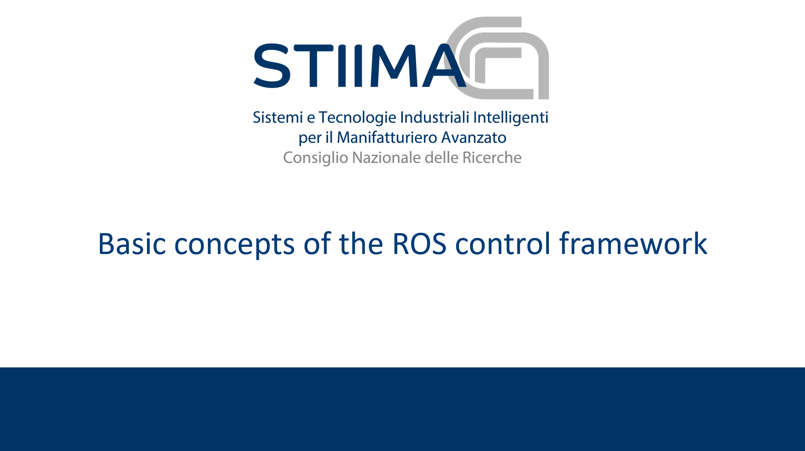

# Extension of ROS-CONTROL #

  

## The design of the framework ##

The repository contains the implementation of an exstension of the [ros_control](http://wiki.ros.org/ros_control "ros_control") framework developed by the Institute of Intelligent Industrial Technologies and Systems for Advanced Manufacturing (STIIMA), of the National Research Council of Italy (CNR-ITIA).

The extension is based on one package and two meta-packages.

* The `cnr_hardware_interfaces` [(readme)](cnr_hardware_interfaces/README.md)
* The `cnr_controller_interfaces` [(readme)](cnr_hardware_interfaces/README.md)
* The `cnr_configuration_manager` [(readme()](cnr_configuration_manager/README.md)

The core of the extension is having encapsulated the lifecyle of the `RobotHw` [(link)](https://github.com/ros-controls/ros_control/wiki/hardware_interface) in a [`nodelet`](http://wiki.ros.org/nodelet).

This design choice allows the implementation of cascade controller architectures, preserving the fastest communication as possible between the nodelets consituting the controller architecture.

A special `RobotHw` called `TopicRobotHw` is provided by the `cnr_hardware_interfaces` package, and it has been designed in order to encaspulate generic topics in the standard `hardware_interface` [(link)](https://github.com/ros-controls/ros_control/wiki/hardware_interface), and therefore to allows the controller accessing the topic content using the handle-based mechanism.  

 

## cnr_hardware_interfaces [(readme)](cnr_hardware_interfaces/README.md) ##

The metapackage is built up on five packages:

1. `cnr_hardware_interface` [(readme)](cnr_hardware_interface/cnr_hardware_interface/README.md): this package is **fully compatible with [ros_control](http://wiki.ros.org/ros_control "ros_control")**. It implements a derived class  `cnr_hardware_interface::RobotHW` that inherits the standard `RobotHW`. The class implements some useful functionalities:
   1. It Integrates a [diagnostics](http://wiki.ros.org/diagnostics) module, to track the times of the read/write and update functions.
   2. It provides a tracking of the state of the class, and it reacts in case of error.
   3. It provides a `prepareSwitch` function to ease the inherited classes.
   4. It integrares a [logger module](www.www) that tracks the input and ouptus of the function, and generates log file for the class.

2. `cnr_hardware_nodelet_interface` [(readme)](cnr_hardware_interfaces/cnr_hardware_nodelet_interface/README.md): this package is a set of utilities that ease the lifecycle management of the `RobotHW` in a `nodelet`. The package allows loading and downloading of a nodelet, and inside the nodelet a infinite-loop is packed in a thread. The loop implements the read/update/write architecture of the **ros_control** architecture. The `RobotHW` is uploaded using the [pluginlib](http://wiki.ros.org/pluginlib), and the actual robot can be easily uploaded just thoguh a parameter, that corresponds to the type of the RobotHW implementation (tha should be properly configured. See [here](cnr_hardware_interfaces/cnr_hardware_interface/README.md)

3. `cnr_topic_hardware_interface` [(readme)](cnr_hardware_interfaces/cnr_topic_hardware_interface/README.md): this pakcage is a specialization of the abstract `RobotHW` class in `cnr_hardware_interface`. Specifically:
   1. It subscribes/publishes a topic of type `joint_states` and it translates the topic field inside the proper handle structures. It allows a generic controller to access the topic field as it is a standard `hardware_interface`
   2. It exports the class using the pluginlib, in order to ease the dynamic loading of the class.

4. `cnr_topics_hardware_interface` [(readme)](cnr_hardware_interfaces/cnr_topics_hardware_interface/README.md): this package is similar to the previous, but it allows the publication and subscription of a set of topics, and it manages more topic types.

5. `cnr_fake_hardware_interface` [(readme)](cnr_hardware_interfaces/cnr_fake_hardware_interface/README.md): This packae implements a fake `RobotHW` that receives the joint position commands, and it copies the information on the feedback fields. It is useful for debugging and simulation.

## cnr_controller_interfaces [(readme)](cnr_controller_interfaces/README.md) ##

The metapackage is built up on five packages:

1. `cnr_controller_interface` [(readme)](cnr_controller_interfaces/cnr_controller_interface/README.md): 
   this package is **fully compatible with [ros_control](http://wiki.ros.org/ros_control "ros_control")**. 
   It implements a  template derived by  `::controller_interface::Controller< T >` 
   [(link)](https://github.com/ros-controls/ros_control/blob/noetic-devel/controller_interface/include/controller_interface/controller.h). 
   The class implements some useful functionalities:
   1. It Integrates a [diagnostics](http://wiki.ros.org/diagnostics) module, to track the times of the read/write and update functions
   2. It provides a tracking of the state of the class, and it reacts in case of error
   3. It provides a `ros::CallbackQueue` to control the flow of the topics managed by the controller
   4. It integrares a [logger module](www.www) that tracks the input and ouptus of the function, and generates log file for the class.

2. `cnr_controller_manager_interface` [(readme)](cnr_controller_interfaces/cnr_controller_manager_interface/README.md): this package is **fully compatible with [ros_control](http://wiki.ros.org/ros_control "ros_control")**. The package is a set of utilities to load/unload start and stop the controller. The controllers namespace are constrained to couple the controllers parameters with the proper hardware_interface parameter.

## cnr_configuration_manager [(readme)](cnr_configuration_manager/README.md) ##

The core of the extension is the `cnr_configuration_manager` [(readme)](cnr_configuration_manager/README.md).

The node has been desgined to allow a dynamic configuration of the controller architecture.

First, it allows the dynamic loading/unloading of many `RobotHW` in parallel encapsulating each `RobotHW` in a different nodelet. 
Then, it allows the loading/unlaoding and start/stop of all the different controllers needed.

The configuration is done trough a proper yaml file, and it is possible to dynamically switch between many different configurations.

## Example of configuration ##

A collaction of Matlab scripts useful for the...

## Dependencies ##

## Example to download ##

## Developer Contact ##

**Authors:**

* Manuel Beschi (<mailto::manuel.beschi@stiima.cnr.it>)  
* Nicola Pedrocchi (<mailto::nicola.pedrocchi@stiima.cnr.it>)  
* Stefano Ghidini (<mailto::stefano.ghidini@stiima.cnr.it>)  

_Software License Agreement (BSD License)_
_Copyright (c) 2020, National Research Council of Italy, Institute of Intelligent Industrial Technologies and Systems for Advanced Manufacturing_
_All rights reserved._

## Acknowledge ##

 [ShareWork webpage](https://sharework-project.eu/)

This project has received funding from the European Union’s Horizon 2020 research and innovation programme under grant agreement No. 820807.
This website reflects only the author’s view and the European Commission is not responsible for any use that may be made of the information it contains.|
